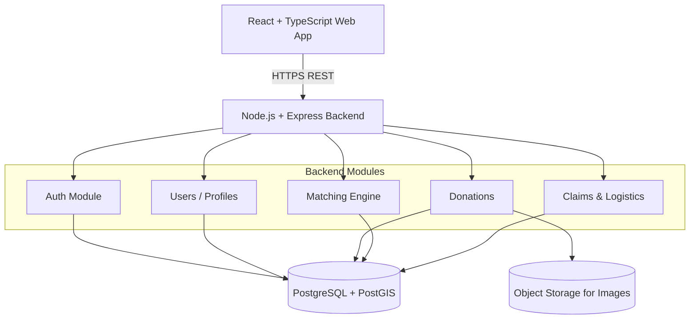

# System Architecture

## 1. High-Level Overview

We are building a **Modular Monolith**. This keeps the deployment simple, avoids network complexity, and allows for clean module separation within a single Node.js process. 

## 2. Technology Stack

* **Frontend:** React, TypeScript, Tailwind CSS.
* **Backend:** Node.js, Express, TypeScript.
* **Database:** PostgreSQL (Relational Data) + PostGIS (Geospatial Location Queries).
* **Storage:** S3-compatible Object Storage (e.g., AWS S3, Cloudflare R2, MinIO). Food images are stored here; DB only holds URLs.
* **Authentication:** JWT Access Tokens (short-lived) + Refresh Tokens (HttpOnly Cookie), with strict Role-Based Access Control (RBAC).

## 3. Internal Module Boundaries (Express)

The `src/` directory is partitioned by domain, not merely by technical role (like controllers vs models). 

* `auth/` - Token generation, password hashing, login/register logic.
* `users/` - Profiles, roles, verification status.
* `donations/` - CRUD operations, State Machine enforcement (CREATED -> AVAILABLE -> CLAIMED -> ...).
* `matching/` - Dynamic scoring algorithm (Distance + Food Type + Quantity + Time). **Stateless (computes on the fly)**.
* `claims/` - Transactional logic for locking and assigning a donation to an NGO.
* `pickups/` - Handling the physical logistics and status updates.
* `gamification/` - Issuing Impact Scores post-completion.
* `shared/` - Database connection, error handlers, loggers, middleware.

## 4. Key Design Decisions

1. **No Microservices:** The team is small; the domain fits perfectly inside one DB.
2. **Dynamic Matching:** Match scores are computed when queried, not saved permanently in PostgreSQL. 
3. **Transactional Integrity:** Claiming a donation uses explicit DB transactions and `UNIQUE(donation_id)` constraints to guarantee atomicity.
4. **Advisory Risk:** The system provides "Food Risk Assessments" (Low/Medium/High) based on defined rules, but does not guarantee "Food Safety".
5. **No AI Dependency:** The MVP relies strictly on robust, rule-based algorithms for matching and risk.
