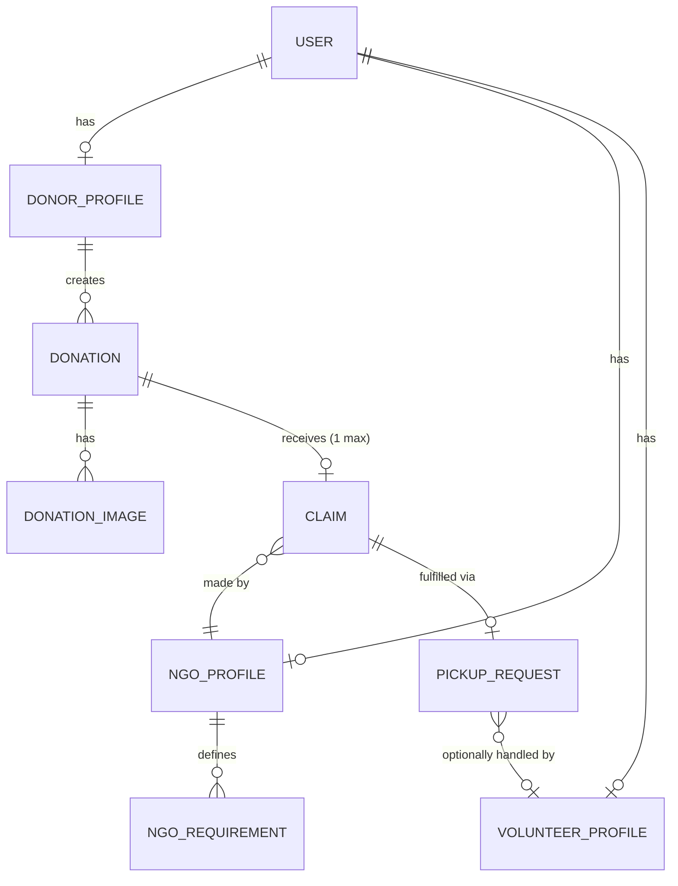

# Database Design & ER Model

This document outlines the core entities, relationships, constraints, and testing matrix for the PostgreSQL database.

## 1. Entities (Layer 1)

**User Management**
* `User`: Core authentication and basic info.
* `DonorProfile`: Specifics for donors (defaults, location).
* `NGOProfile`: Specifics for NGOs (verification status, location).
* `VolunteerProfile`: Specifics for volunteers (vehicle, availability) - *designed now, used later*.

**Donation Core**
* `Donation`: The primary entity tracking surplus food.
* `DonationImage`: 1-to-many images for a donation (stored in S3, storing URL here).
* `NGORequirement`: NGO preferences used for matching.

**Fulfillment**
* `Claim`: Represents an NGO accepting a donation.
* `PickupRequest`: Logistics tracking for the fulfillment of a claim.

**Platform Operations**
* `Notification`: In-app alerts.
* `ImpactScore`: Gamification metrics.
* `AuditLog`: Immutable history of critical admin/system actions.

## 2. Entity-Relationship (ER) Diagram (Layer 2)

## 3. Core Tables & Constraints (Layer 3)

We derive these from the specific user flows and business rules.

### `users`
* `id` (UUID, PK)
* `email` (String, Unique)
* `password_hash` (String)
* `role` (Enum: DONOR, NGO, VOLUNTEER, ADMIN)
* `created_at`, `updated_at`

### `donor_profiles`
* `user_id` (UUID, PK, FK to users)
* `location` (Geometry Point - PostGIS)
* `default_prep_time`, `default_storage`, `preferred_pickup` (Enums/Strings)

### `ngo_profiles`
* `user_id` (UUID, PK, FK to users)
* `location` (Geometry Point - PostGIS)
* `is_verified` (Boolean, default false)
* `max_pickup_radius_km` (Integer)

### `donations`
* `id` (UUID, PK)
* `donor_id` (UUID, FK to donor_profiles)
* `status` (Enum: CREATED, AVAILABLE, CLAIMED, PICKUP_ASSIGNED, PICKED_UP, DELIVERED, COMPLETED, CANCELLED, EXPIRED, REJECTED)
* `food_category` (String)
* `quantity_kg` (Decimal)
* **Time Tracking (Crucial distinction):**
  * `prepared_at` (Timestamp)
  * `usable_until` (Timestamp)
  * `available_from` (Timestamp)
  * `available_until` (Timestamp)
* **Constraints:**
  * `quantity_kg > 0`
  * `usable_until > prepared_at`
  * `available_until > available_from`

### `claims`
* `id` (UUID, PK)
* `donation_id` (UUID, Unique, FK to donations) - *Unique enforces 1 claim per donation*
* `ngo_id` (UUID, FK to ngo_profiles)
* `status` (Enum: PENDING, APPROVED, CANCELLED)
* `created_at` (Timestamp)

### `pickup_requests`
* `id` (UUID, PK)
* `claim_id` (UUID, Unique, FK to claims)
* `type` (Enum: NGO_PICKUP, DONOR_DELIVERY, VOLUNTEER_PICKUP)
* `volunteer_id` (UUID, Nullable, FK to volunteer_profiles)

## 4. Database Test Matrix

Before writing backend logic, we will write DB-level integration tests to ensure constraints hold.

| Test Case | Expected Result | Mechanism |
| :--- | :--- | :--- |
| **Negative or Zero quantity** | ❌ Reject | DB Constraint `CHECK (quantity_kg > 0)` |
| **Usable time before Prep time** | ❌ Reject | DB Constraint `CHECK (usable_until > prepared_at)` |
| **Unverified NGO claims** | ❌ Reject | App Logic / Postgres Trigger checking `ngo_profiles.is_verified` |
| **Two NGOs claim simultaneously** | ✅ Only one succeeds | Atomicity: Unique constraint on `claims.donation_id` & Transaction |
| **Cancelled donation claimed** | ❌ Reject | App Logic / Trigger checking `donations.status = AVAILABLE` |
| **Completed donation edited** | ❌ Reject | App Logic / Trigger blocking updates on `COMPLETED` |
| **Valid PostGIS location** | ✅ Accept | PostGIS `Point` geometry validation |
| **Invalid coordinates (e.g., lat 100)**| ❌ Reject | PostGIS constraint / App validation |
